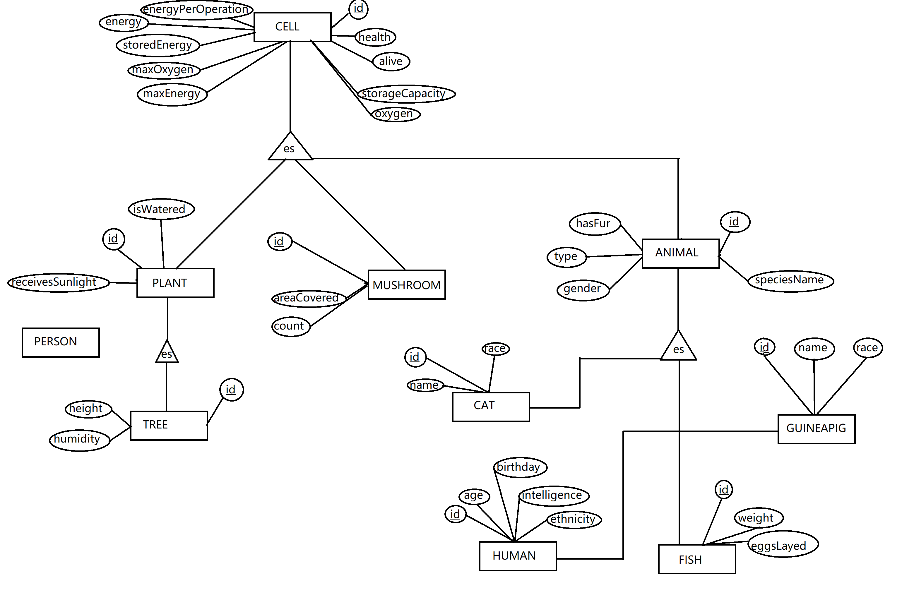

# Relational Model

ANIMAL(id, speciesName, hasFur, type, gender)

CAT(id, name, race, meow)

CELL(id, health, energyPerOperation, energy, storedEnergy, oxygen, alive, maxEnergy, maxOxygen, storageCapacity)

FISH(id, weight, eggsLayed)

GUINEAPIG(id, name, race)

HUMAN(id, age, birthday, intelligence, ethnicity)

MUSHROOM(id, areaCovered, count)

PERSON(id, name)

PLANT(id, receivesSunlight, isWatered)

TREE(id, height, humidity)

My project hierarchy is a particular one which doesn't have any relationships between entities, this SQL schema would only serve as a way of storaging simple data

- Note: If relations are needed, I shall redo all the hierarchy to one that will properly adapt to future requirements instead.

# Entity-Relation Model (graphical representation of RM)

## Changelog:
### Oct 3.
- Removed last readme sections that aided in showing my code during the exam
- Added my first try at a relational model
### Sep 18.
- New readme section: It shows where are some of the most important topics reflected in the project's code.
- Removed TO-DO and relevant code sections from README to make the new section stand out
- Finished the lambda functions, complex enums, streaming and reflection homework, everything is in the main method.
### Sep 12.
- Moved whole project to quickstart maven archetype
- Deleted all demo code for previous homework and stored it in a txt just in case
- Installed dependencies for StringUtils and FileUtils
- Read unique word count from file using StringUtils and FileUtils done in Main class

### Sep 6.
- Built jar file located in 'target' folder.
- Different maven lifecycle commands worked succesfully (install, package, compile, validate) deploy command didn't work

### Aug 30.
- Installed maven on the project
- Successfully installed log4j through maven
- We are now able to log things to a file and to the console at the same time

### Aug 29.
- Added 4 arraylists.
- Added a custom coded linked list with 'Person' as data type

### Aug 26.
- Installed log4j in the current project
- Added 5 custom exceptions (NoNameException, NegativeAgeException, NegativeIntException, InvalidGenderException and TooYoungException, all of them are in class 'Person').
- Handled them first with throws inside 'Person' class and with try-catch in the main() method.
- Used try-with-resources inside 'Person' class on static method 'personFromInput' utilizing the Scanner class.

### Aug 22.
- Changed folder name to better fit the format of future homework.
- Added 5 interfaces (Eater, Moveable, Thinker, Reproducible, Growable)
- Fixed camelCase for all method names.
- Changed Cell's kill() method to be final.
- Changed Person's variable 'name' to be final.
- Changed Person's class type to be final.
- Added static variable animalCount to Animal
- Added static block in Animal to initialize animalCount = 0.
- Added static method in Animal to return animalCount.
- Improved the main method in Main to better reflect each requested feature.

### Aug 6.
- Sorting algorithm done.